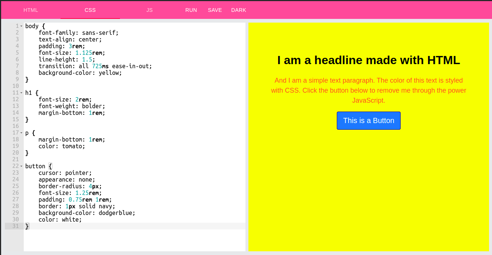
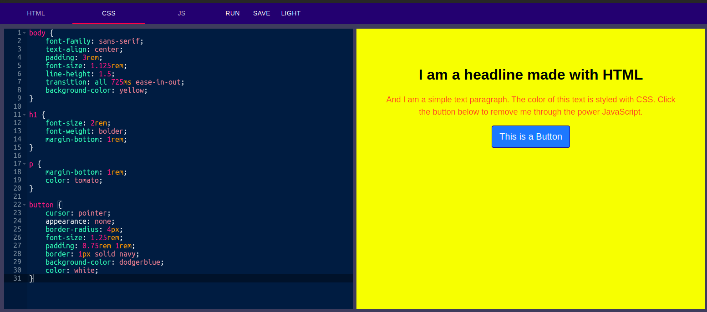
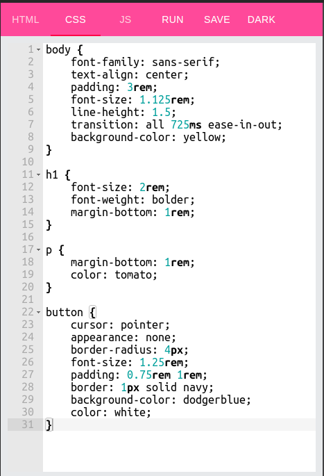
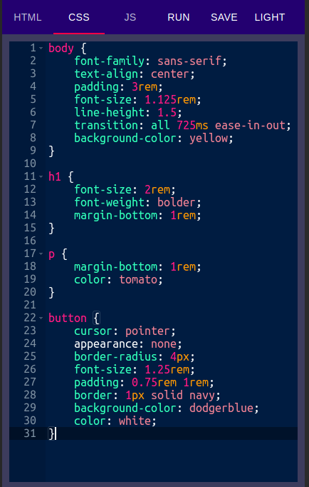
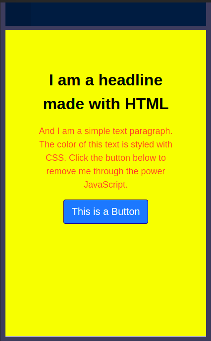

# Bro Code Web IDE 😃

## Features
1. Mobile Responsive
2. Dark/Light Mode
3. Different Tabs for HTML/CSS/JS
4. Output on same window
5. Code is automatically saved in browser
6. Download code in a file

## Libraries Used
1. React
2. Redux
3. Redux Saga
4. Redux Persist
5. Material UI
5. React Ace

## Screenshots

> Contributions are welcomed.